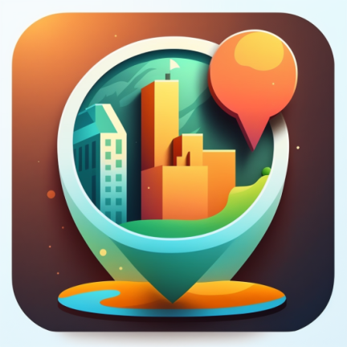
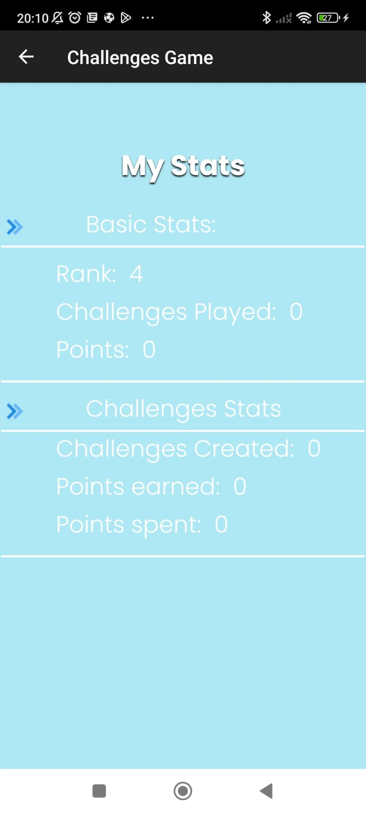
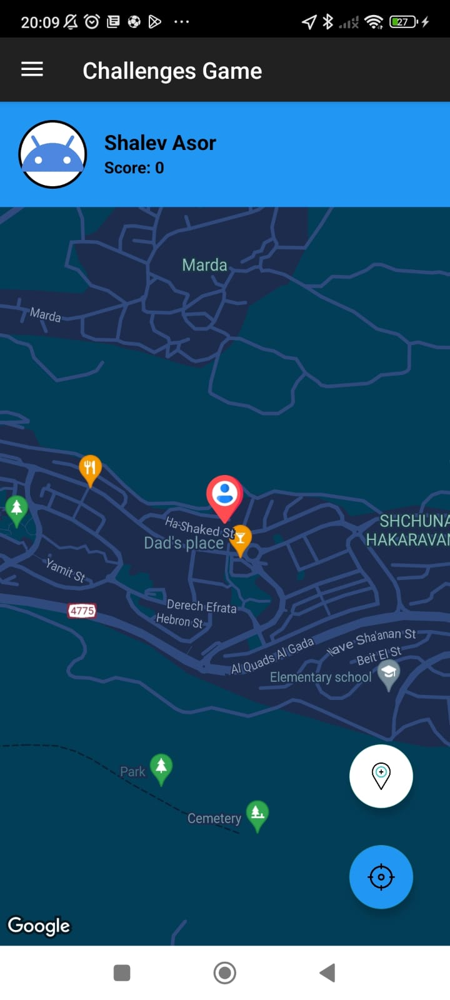
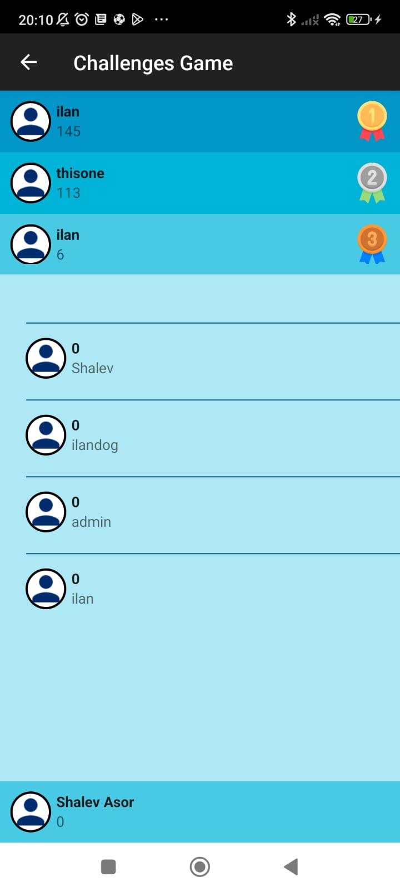

# Geo-Champ

 <!-- Update with your image path -->

**Geo-Champ** is an exhilarating Android game app that combines geography, knowledge, and speed challenges into one thrilling experience. Test your skills, explore the world, and climb the global leaderboards with this unique app!

## 🚀 Features

- **Geography-Based Challenges:** Test your geographical knowledge with challenges that display your current location on Google Maps and present exciting tasks.
- **Mini-Games:** Engage in a variety of mini-games, including guessing cities or flags, solving math problems against the clock, and navigating to destinations quickly.
- **Topscores Section:** Compete with players worldwide and strive to secure a spot in the top 3. See how you rank among the best!
- **User Stats:** Track your progress with detailed statistics on your performance across different challenges. Monitor your improvement and aim for personal bests.
- **Addictive Gameplay:** Enjoy a blend of education and entertainment as you explore diverse landscapes and famous landmarks.

## 📷 Screenshots

 <!-- Adjust width as needed -->
 <!-- Adjust width as needed -->
 <!-- Adjust width as needed -->

## 📲 Get Started

1. **Download the App:** [Geo-Champ on Google Play](https://play.google.com/store/apps/details?id=com.geochamp.myapp&hl=en_US)
2. **Login:** Sign in to start exploring and challenging yourself.
3. **Play & Compete:** Participate in mini-games and challenges, track your stats, and aim for the top of the leaderboard!

## 🤝 Contributing

We welcome contributions to enhance Geo-Champ. If you have any suggestions or improvements, please open an issue or submit a pull request.
